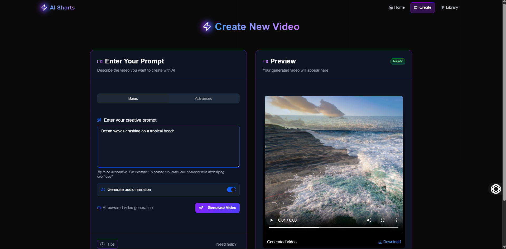

# 🎬 Shorts - AI Video Generation Platform ✨

<div align="center">
  
  <p><em>✨ Transform your ideas into stunning videos with just a text prompt! ✨</em></p>
</div>

## 🚀 Overview

Shorts is a powerful AI-powered platform that transforms text descriptions into high-quality videos. Whether you're a content creator, marketer, or storyteller, Shorts helps you bring your ideas to life without complex video editing skills.

## 🌟 Features

- **🪄 Text-to-Video Generation**: Create videos from simple text descriptions
- **🎙️ Audio Narration**: Optional AI voice narration for your videos
- **🎮 User-Friendly Interface**: Clean, intuitive design for seamless creation
- **🔄 Social Sharing**: Easily share your creations on WhatsApp, Instagram, Twitter, and Facebook
- **📚 Video Library**: Save and manage all your generated videos
- **📱 Responsive Design**: Works on desktop and mobile devices

## 🛠️ Tech Stack

### Frontend 🖥️

- ⚛️ React with TypeScript
- ⚡ Vite for fast development
- 🎨 Tailwind CSS for styling
- 🎭 Framer Motion for animations
- 🧩 Shadcn UI components

### Backend 🔧

- 🐍 Python with Flask
- 🤖 AI video generation using pre-trained model
- 🔐 RESTful API architecture

## 📋 Getting Started

### Prerequisites 📝

- Node.js (v16+)
- Python (v3.8+)
- npm or yarn
- pip

### Installation 💻

1. Clone the repository

```bash
git clone https://github.com/yourusername/shorts.git
cd shorts
```

2. Install dependencies for both frontend and backend

```bash
# Install frontend dependencies
cd frontend
npm install

# Install backend dependencies
cd ../backend
pip install -r requirements.txt
```

3. Set up environment variables

```bash
# In the backend directory
cp .env.example .env
# Edit .env with your configuration
```

4. Start the development servers

```bash
# Start backend (from backend directory)
python app.py

# Start frontend (from frontend directory)
npm run dev
```

5. Open your browser and navigate to `http://localhost:5173` 🌐

## 📸 Screenshots

<div align="center">
  
  
  
</div>

## 🤝 Contributing

Contributions are welcome! Please feel free to submit a Pull Request.

1. 🍴 Fork the repository
2. 🌿 Create your feature branch (`git checkout -b feature/amazing-feature`)
3. 💾 Commit your changes (`git commit -m 'Add some amazing feature'`)
4. 📤 Push to the branch (`git push origin feature/amazing-feature`)
5. 🔍 Open a Pull Request

---

<div align="center">
  <p>Made ❤️ by John Wesley</p>
</div>
